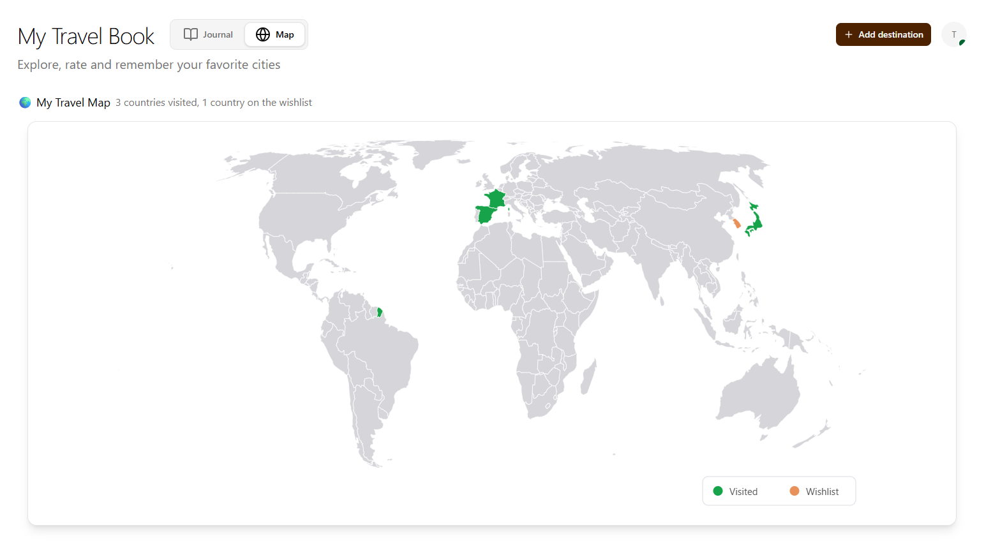

## My Travel Book

A web application to keep track of the cities and countries you have visited or want to visit.

Currently in development 🏗️





### Technologies used :

- Next.js 16
- TypeScript
- Prisma ORM
- PostgreSQL
- React Query
- Zod
- React Hook Form
- Tailwind CSS
- Shadcn UI
- Authentification with NextAuth.js
- Bucket S3 to store images of destinations : Cloudflare R2
- Tests with Jest and React Testing Library
- CI/CD with GitHub Actions
- Error monitoring with Sentry
- Uptime monitoring with UptimeRobot

### Features :

- Add destinations (cities and countries)
- Mark destinations as visited or on wish list
- View list of visited destinations and wish list
- Map view of visited/wish list destinations
- User authentication

### Security :

- Security headers (X-Content-Type-Options, X-Frame-Options, X-XSS-Protection, Referrer-Policy, Permissions-Policy)
- API route protection via middleware (authentication required for POST/PUT/DELETE)
- Server-side input validation with Zod
- Password hashing with Argon2
- Ownership verification on delete operations
- Password excluded from API responses

## Setup Jest (tests unitaires)

To set up Jest for unit testing, the following dependencies were installed:

```
npm install --save-dev jest           # Test runner
npm install --save-dev @types/jest    # TypeScript types for Jest
npm install --save-dev ts-jest        # TypeScript transformer for Jest
npm install --save-dev @testing-library/react    # React component testing utilities
npm install --save-dev @testing-library/jest-dom # Extra DOM assertions
npm install --save-dev babel-jest     # Babel transformer for Jest
npm install --save-dev @babel/preset-env         # Modern JS to Node
npm install --save-dev @babel/preset-typescript  # TypeScript to JS
npm install --save-dev @babel/preset-react       # JSX/TSX to JS
```

**Configuration added :**

- a file `babel.config.js` with :
  ```js
  module.exports = {
    presets: [
      ["@babel/preset-env", { targets: { node: "current" } }],
      "@babel/preset-typescript",
      "@babel/preset-react",
    ],
  };
  ```
- In `jest.config.ts` :
  ```js
  transform: {
  	'^.+\\.(ts|tsx|js|jsx)$': 'babel-jest',
  },
  ```
  and
  ```js
  transformIgnorePatterns: [
  	'/node_modules/(?!uuid)',
  	'\\.pnp\\.[^/]+$'
  ],
  ```

## Sentry

Sentry is used to monitor errors and performance in production. It captures crashes, exceptions and slow transactions, allowing to debug issues remotely.

## Deployment

The app is deployed on **Vercel** with a **Neon** PostgreSQL database.

### Steps to deploy

1. Create a [Neon](https://neon.tech) project and copy the connection string.
2. In Vercel, add all environment variables from `.env`, replacing `DATABASE_URL` with the Neon connection string and `NEXTAUTH_URL` with the Vercel domain.
3. Push to your main branch — Vercel deploys automatically.
4. Run migrations and seed against the production database:

```bash
# Temporarily set DATABASE_URL to the Neon connection string in .env
npx prisma migrate deploy
npx prisma db seed
# Then restore the local DATABASE_URL
```
