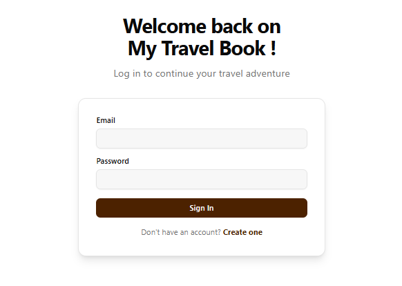
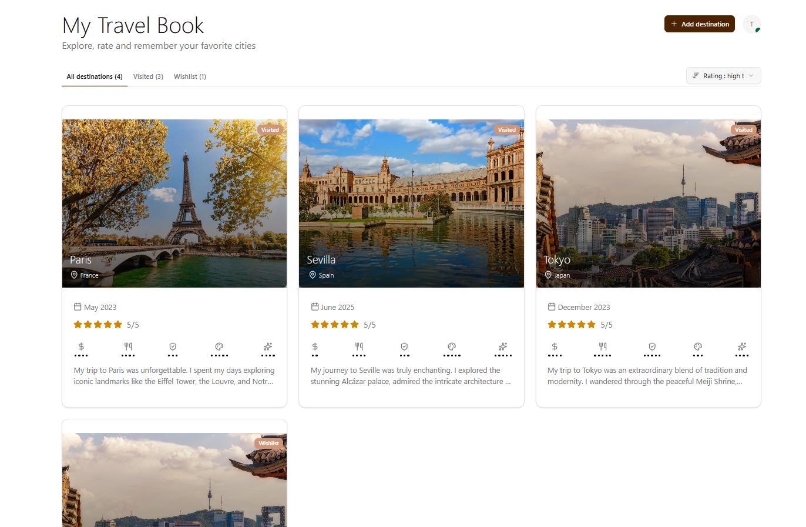
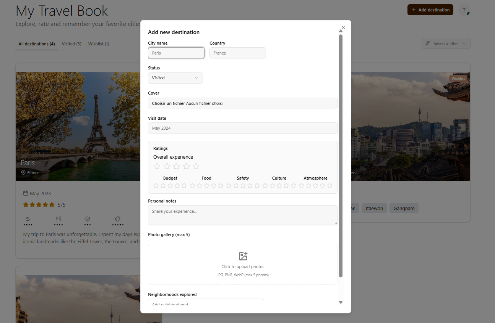

## My Travel Book

A web application to keep track of the cities and countries you have visited or want to visit.

Currently in development 🏗️







### Technologies used : 
- Next.js 16 
- TypeScript
- Prisma ORM
- PostgreSQL
- React Query
- Zod
- React Hook Form
- Tailwind CSS
- Shadcn UI
- Authentification with NextAuth.js
- Bucket S3 to store images of destinations : Cloudflare R2
- Tests with Jest and React Testing Library
- Ci/CD with GitHub Actions

### Features :
- Add destinations (cities and countries)
- Mark destinations as visited or on wish list
- View list of visited destinations and wish list


## Setup Jest (tests unitaires)
To set up Jest for unit testing, the following dependencies were installed:

```
npm install --save-dev jest           # Test runner
npm install --save-dev @types/jest    # TypeScript types for Jest
npm install --save-dev ts-jest        # TypeScript transformer for Jest
npm install --save-dev @testing-library/react    # React component testing utilities
npm install --save-dev @testing-library/jest-dom # Extra DOM assertions
npm install --save-dev babel-jest     # Babel transformer for Jest
npm install --save-dev @babel/preset-env         # Modern JS to Node
npm install --save-dev @babel/preset-typescript  # TypeScript to JS
npm install --save-dev @babel/preset-react       # JSX/TSX to JS
```

**Configuration added :**
- a file `babel.config.js` with :
	```js
	module.exports = {
		presets: [
			['@babel/preset-env', { targets: { node: 'current' } }],
			'@babel/preset-typescript',
			'@babel/preset-react'
		],
	};
	```
- In `jest.config.ts` :
	```js
	transform: {
		'^.+\\.(ts|tsx|js|jsx)$': 'babel-jest',
	},
	```
	and
	```js
	transformIgnorePatterns: [
		'/node_modules/(?!uuid)',
		'\\.pnp\\.[^/]+$'
	],
	```
